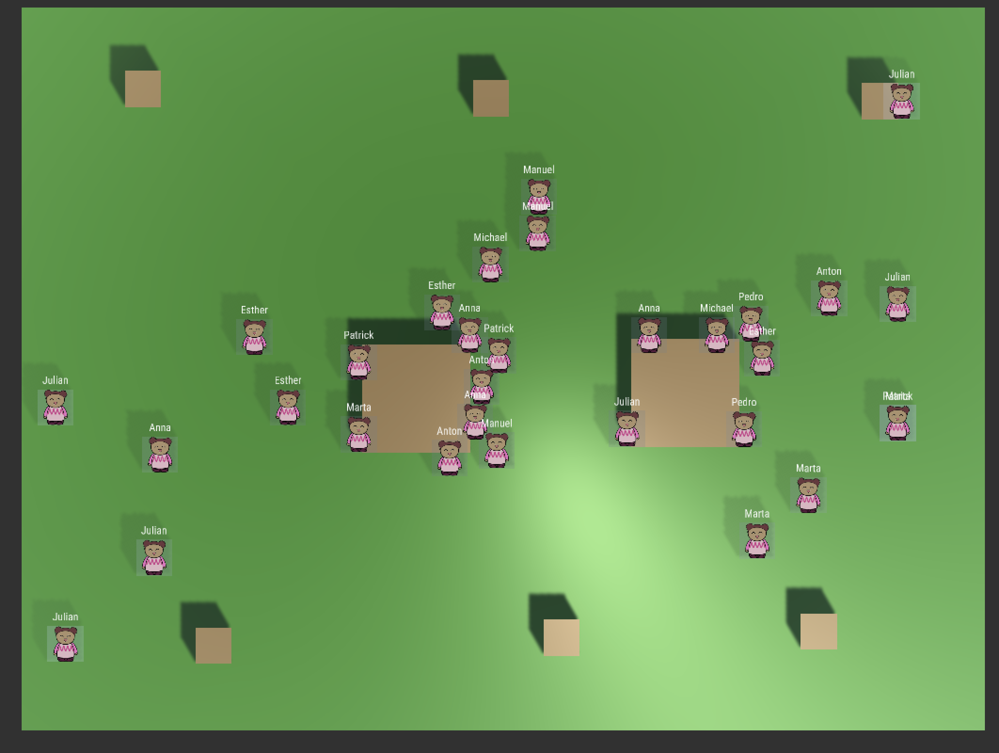

# Prototype 2

This is the second Prototype implementing

* A basic complete mechanic of the simulation
* Working with a few number of agents
* Includes basic elements of the environment (individual and group tables)
* Simple Visualization showing agent status
* Logging of status and action of each agent for each iteration

## Images

The simulation looks like this

And seems to work fine with many more Agents ...

## Download
Download the release V1.0 [here](https://github.com/mapa17/breakfastclub/releases/tag/v1.0)

## Next Step

The Next version of the simulation should add

* A Framework to analyze aggregated classroom statistics (like, noise, average energy, happiness, attention, the distribution of action states)
* Include some basic UI elements showing aggregated stats
* Build an infrastructure to define Agent Profiles and classroom compositions
