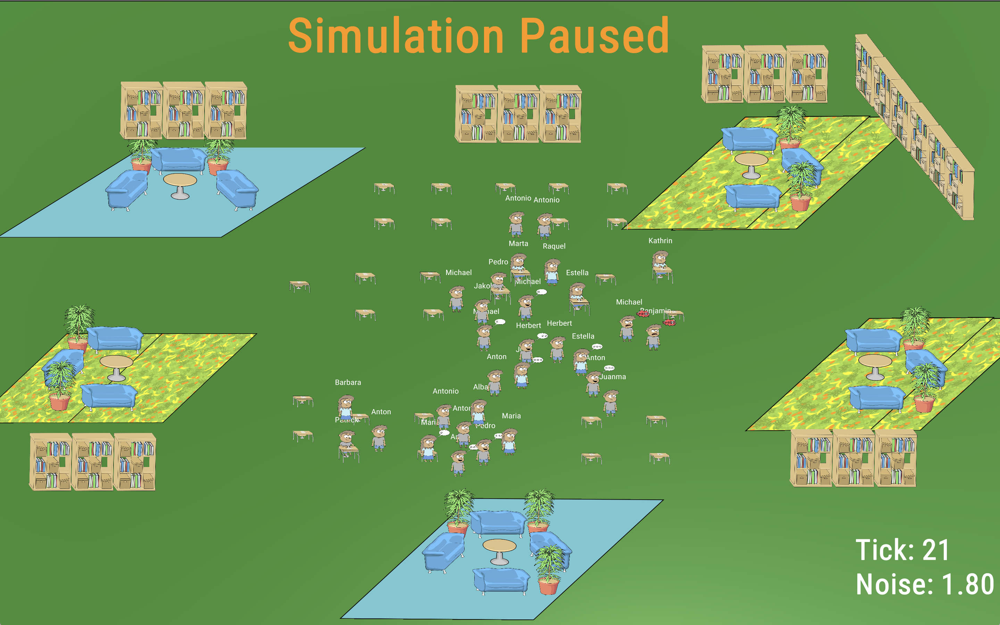

# Breakfastclub

**Breakfastclub** is a multi-agent based social simulation platform of a virtual classroom.
It is currently under active development as part of a Master Thesis by [Manuel Pasieka](http://github.com/mapa17) at
the university [UNIR](http://unir.net), under supervision of [Prof. Dr. Michael Kickmeier-Rust](https://www.phsg.ch/de/team/prof-dr-michael-kickmeier-rust).

# Latest Development

The latest version is v2.0 and can be found [here](https://github.com/mapa17/breakfastclub/releases/tag/v2.0)

# Downloads

Binaries are provided for the Windows and macOS platforms compressed with [7zip](https://www.7-zip.org/)

* [Windows](binaries/windows)
* [macOS](binaries/macos)

# Documentation

The master thesis itself is the most complete documentation of the project and can be found [here](https://github.com/mapa17/TFM-breakfastclub/blob/master/src/Breakfastclub.pdf)

A few special topics and a presentation of the project can be found [here](docs) ...
